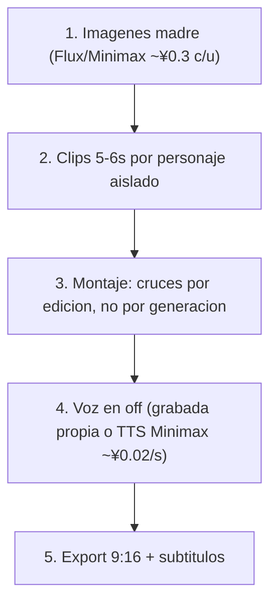

# Pipeline de producción con wind-comic

> Cómo producir el contenido. Qué producir está en los arcos; la consistencia visual en [biblia-visual.md](biblia-visual.md).
> Herramienta: instancia local de `wind-comic` (en la raíz del proyecto). Es BYO (bring your own keys): el costo es de las APIs, no de la app.

---

## 1. Estrategia de generación: un personaje por clip

Generar cada personaje/elemento **aislado** y unir en montaje. Es lo más barato, lo más consistente y el lenguaje de cine correcto.

| Arco | Elemento a lockear | Motor recomendado | Por qué |
|---|---|---|---|
| 1 · Mano Negra | Ninguno (solo mano + cadenita) | Minimax Hailuo (~¥0.1/s) | La mano se mantiene con prompt + primer frame; no gasta lock |
| 2 · Charles | 1 sujeto | Minimax S2V o Kling | S2V lockea 1 protagonista; silueta de espaldas = poca cara = fácil |
| 3 · Ornitorrincos | Referencia de imagen por animal | Kling FLF o Seedance multi-ref | Consistencia desde imagen madre como primer frame (I2V) |

Referencia de motores, capacidades y costos: `wind-comic/docs/video-providers.md` e `image-providers.md`.

---

## 2. Flujo



1. **Imágenes madre primero** (~¥0.3 c/u): retrato de Charles de espaldas, mano con cadenita, un ornitorrinco por animal, paisajes Pangea. Son la biblia visual; todo parte de acá.
2. **Clips de 5–6s por personaje aislado**: la duración barata. En la instancia local con `PLAN_GATE_DISABLED=1` no aplican los gates de plan de pago.
3. **Montaje**: los cruces (mano ↔ ornitorrincos, Charles ↔ familia) se resuelven por **corte**, no generando personajes juntos. La pantalla partida Argentina/Australia del Arco 3 = dos clips independientes montados.
4. **Voz**: off documental (Attenborough). Recomendado grabarla propia (es la voz del proyecto y es gratis); alternativa TTS Minimax (~¥0.02/s).
5. **Export**: 9:16, subtítulos quemados si corresponde.

---

## 3. Presupuesto estimado

Paquete completo (3 arcos, ~15 clips de 5s + ~12 imágenes madre, Minimax como motor principal):

| Etapa | Cálculo | Total aprox. |
|---|---|---|
| Imágenes madre | 12 × ¥0.3 | ~¥3.6 |
| Video (15 × 5s × ¥0.1 Minimax) | | ~¥7.5 |
| TTS (si se usa, ~3 min) | 180s × ¥0.02 | ~¥3.6 |
| **Total** | | **~¥15 (barato) a ~¥30 (con Kling en planos clave)** |

El video es el mayor costo; usar Kling (~¥0.2/s) o Veo (~¥0.6/s) solo en los planos-gancho.

---

## 4. Notas de configuración (instancia local)

- **`PLAN_GATE_DISABLED=1`** en `.env.local` desbloquea todas las funciones sin pago a la app (los gates son de la versión SaaS).
- **`MOCK_ENGINES=1`** genera salidas fake sin llamar APIs: útil para probar el flujo de montaje antes de gastar.
- Keys reales necesarias según motor: `MINIMAX_API_KEY` (imagen+video+TTS), `KELING_API_KEY` (Kling), etc. Ver `wind-comic/.env.example`.

---

## 5. Plantilla de "plano-a-plano" (pendiente por arco)

Cuando se baje cada arco a producción, completar por clip:

```
Clip N — [nombre]
- Duración: 5s
- Imagen madre / primer frame: [archivo]
- Motor: [minimax / kling / ...]
- Prompt: [texto exacto para wind-comic]
- Aspect ratio: 9:16
- Audio: [off / música / ninguno]
- Montaje: [con qué se corta antes/después]
```
