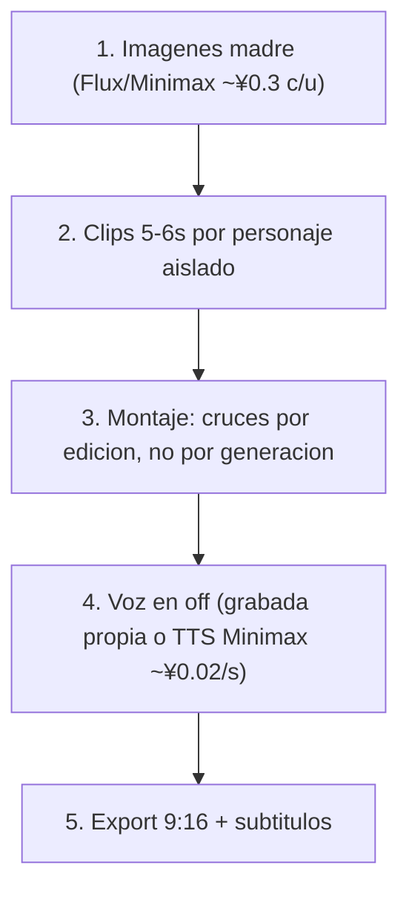

# Pipeline de producción con wind-comic

> Cómo producir el contenido. Qué producir está en los arcos; la consistencia visual en [biblia-visual.md](biblia-visual.md). El alcance completo de la caja de herramientas (todo lo que wind-comic puede hacer, más allá de este flujo recomendado) está en [toolkit-wind-comic.md](toolkit-wind-comic.md).
> Herramienta: instancia local de `wind-comic` (en la raíz del proyecto). Es BYO (bring your own keys): el costo es de las APIs, no de la app.

---

## 1. Estrategia de generación: un personaje por clip

Generar cada personaje/elemento **aislado** y unir en montaje. Es lo más barato, lo más consistente y el lenguaje de cine correcto.

| Arco | Elemento a lockear | Motor recomendado | Por qué |
|---|---|---|---|
| 1 · Mano Negra | Ninguno (solo mano + cadenita) | Minimax Hailuo (~¥0.1/s) | La mano se mantiene con prompt + primer frame; no gasta lock |
| 2 · Charles | 1 sujeto | Minimax S2V o Kling | S2V lockea 1 protagonista; silueta de espaldas = poca cara = fácil |
| 3 · Ornitorrincos | Referencia de imagen por animal | Kling FLF o Seedance multi-ref | Consistencia desde imagen madre como primer frame (I2V) |

Referencia de motores, capacidades y costos: `wind-comic/docs/video-providers.md` e `image-providers.md`.

---

## 2. Flujo



1. **Imágenes madre primero** (~¥0.3 c/u): retrato de Charles de espaldas, mano con cadenita, un ornitorrinco por animal, paisajes Pangea. Son la biblia visual; todo parte de acá.
2. **Clips de 5–6s por personaje aislado**: la duración barata. En la instancia local con `PLAN_GATE_DISABLED=1` no aplican los gates de plan de pago.
3. **Montaje**: los cruces (mano ↔ ornitorrincos, Charles ↔ familia) se resuelven por **corte**, no generando personajes juntos. La pantalla partida Argentina/Australia del Arco 3 = dos clips independientes montados.
4. **Voz**: off documental (Attenborough). Recomendado grabarla propia (es la voz del proyecto y es gratis); alternativa TTS Minimax (~¥0.02/s).
5. **Export**: 9:16, subtítulos quemados si corresponde.

---

## 3. Presupuesto estimado

Paquete completo (3 arcos, ~15 clips de 5s + ~12 imágenes madre, Minimax como motor principal):

| Etapa | Cálculo | Total aprox. |
|---|---|---|
| Imágenes madre | 12 × ¥0.3 | ~¥3.6 |
| Video (15 × 5s × ¥0.1 Minimax) | | ~¥7.5 |
| TTS (si se usa, ~3 min) | 180s × ¥0.02 | ~¥3.6 |
| **Total** | | **~¥15 (barato) a ~¥30 (con Kling en planos clave)** |

El video es el mayor costo; usar Kling (~¥0.2/s) o Veo (~¥0.6/s) solo en los planos-gancho.

---

## 4. Notas de configuración (instancia local)

- **`PLAN_GATE_DISABLED=1`** en `.env.local` desbloquea todas las funciones sin pago a la app (los gates son de la versión SaaS).
- **`MOCK_ENGINES=1`** genera salidas fake sin llamar APIs: útil para probar el flujo de montaje antes de gastar.
- Keys reales necesarias según motor: `MINIMAX_API_KEY` (imagen+video+TTS), `KELING_API_KEY` (Kling), etc. Ver `wind-comic/.env.example`.

---

## 5. Convención de IDs y archivos de assets

IDs con prefijo de arco, en minúsculas:

| Unidad | Formato de ID | Ejemplo |
|---|---|---|
| Imagen madre | `a{arco}-m{nn}` | `a3-m01` |
| Clip | `a{arco}-{reel}{n}` | `a3-a1`, `a3-c2` |

Archivos (en la raíz del proyecto, fuera de `docs/`):

- **Generados**: `assets/arco-{N}/madre/{id}-{slug}.png` y `assets/arco-{N}/clips/{id}-{slug}.mp4`. Ej.: `assets/arco-3/madre/a3-m01-madre-ornitorrinco.png`.
- **Material de origen real** (no generado, aportado a mano): `assets/fuentes/{slug}.{ext}`. Ej.: `assets/fuentes/rocas-coloradas-real.jpg`, `assets/fuentes/charles-jones-referencia.jpeg`.

El nombre de archivo es la referencia única: es lo que se sube como `firstFrame`/`lastFrame` en la UI y lo que citan las fichas de clip.

---

## 6. Plantillas de ingesta (campos 1:1 con la UI de wind-comic)

Campos exactos que consume cada página (verificados en [toolkit-wind-comic.md](toolkit-wind-comic.md)). Prompts e inputs de modelo **en inglés**; títulos, audio y montaje en español.

**Regla de cámara:** los 12 presets operativos de `/dashboard/u2v` y `/dashboard/create` (`push-in`, `pull-out`, `orbit`, `dolly-zoom`, `whip-pan`, `crash-zoom`, `handheld`, `locked-tripod`, `crane-up`, `tilt-down`, `tracking`, `arc`) van SIEMPRE en el campo `cameraPreset`, nunca duplicados en el texto del prompt. Si el movimiento no tiene preset equivalente (ej. "gentle aerial drift"), se describe en el prompt y el preset queda vacío. Si el prompt no trae ningún término de cámara y no se elige preset, el motor agrega por defecto un push-in sutil.

**Aspect ratio:** U2V no tiene campo de aspect; el clip hereda el de la imagen fuente. Por eso toda imagen madre se genera en 9:16.

### Personaje → Character Studio (`/dashboard/characters`)

```
Personaje: [nombre ES]
- name: [nombre]
- description (EN): [quién es, rol narrativo]
- appearance (EN): [aspecto físico + vestuario, autocontenido]
- styleKeywords (EN): [estilo visual, ej. "paper cutout silhouette, shadow puppet theater"]
- visualTags (EN): [tag1, tag2, ...]
- imageUrls: [archivo(s) de assets/; se sube la imagen y se pega la URL resultante]
- Voz: routing [género/nombre] · override: [voz elegida o —]
```

### Imagen madre / locación → generación o preview-shot (`/dashboard/create`)

```
[id] — [título ES]
- idea / prompt (EN): [con el STYLE-BLOCK de biblia-visual.md §1 embebido literal + la línea de tinte del guion de color del arco]
- style: Woodcut Print   (preset más cercano al look silueta; u otro si rompe la estética a propósito)
- aspect: 9:16
- Archivo destino: assets/arco-N/madre/[id]-[slug].png
```

### Clip → U2V / U2V-FLF (`/dashboard/u2v`)

```
Clip [id] — [título ES]
- Herramienta: U2V | U2V-FLF
- firstFrame: [id de imagen madre] (archivo)
- lastFrame: [solo FLF: id + archivo]
- cameraPreset: [1 de los 12 | —]
- duration: 5 | 6 | 10 | 15   (FLF: solo 5 | 10)
- Motion prompt (EN, ≤500 caracteres, sin lenguaje de cámara duplicado): [...]
- Vision-Audit (EN): sceneDescription: [...] · action: [...] · mood: [...]
- Audio (ES): [off / música / ninguno]
- Montaje (ES): [con qué se corta antes/después]
```
