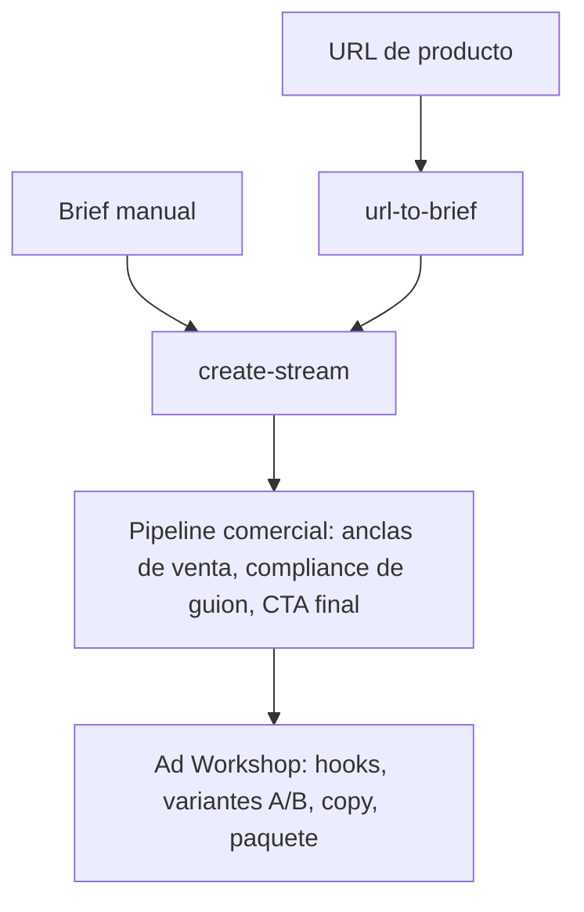

# Toolkit wind-comic — mapa de alcance completo

> Qué **existe** en la herramienta, no cómo usarla paso a paso. Es la caja de herramientas disponible para cualquier arco del proyecto, sin sesgarse por lo que se necesita hoy.
>
> - Flujo de producción, estrategia "un personaje por clip" y presupuesto del proyecto: [pipeline-wind-comic.md](pipeline-wind-comic.md).
> - Anclas de estilo y prompts madre del proyecto: [biblia-visual.md](biblia-visual.md).
> - Fuente canónica de cada proveedor (parámetros, ejemplos): `wind-comic/docs/{llm,image,video,tts}-providers.md`.
> - `wind-comic/` y `MoneyPrinterTurbo/` son solo herramientas; este documento no las modifica, solo las describe.

**Cómo leer las tablas:** la columna **Acceso** distingue **UI** (una página del dashboard, operable sin código) de **API/interno** (solo se llama por API o corre automático dentro del pipeline, sin botón dedicado).

---

## 1. Guion / LLM

### Pipeline de agentes

Motor: `services/hybrid-orchestrator.ts`, invocado por `POST /api/create-stream`. Ejecuta 9 etapas en orden:

| # | Agente | Qué hace |
|---|---|---|
| 1 | **Director** | Analiza la idea (o el guion pegado) y genera el plan: género, estilo, personajes, escenas, estructura de tomas |
| 2 | **Style Bible** | Genera 1 frame canónico de identidad visual, usado como `sref` en todo el proyecto |
| 3 | **Writer** | Escribe el guion toma por toma (metodología McKee); corre pacing + hook audit al terminar |
| 4 | **Character Designer** | Diseña personajes con turnaround + Character DNA |
| 5 | **Scene Designer** | Genera las imágenes de escena a partir del guion |
| 6 | **Storyboard** | Planificación textual + render de storyboards en cadena de referencias |
| 7 | **Video Producer** | Genera cada plano probando motores de video en cadena |
| 8 | **Editor** | TTS por personaje, BGM, subtítulos, composición final (ffmpeg) |
| 9 | **Producer** | Revisión final sobre 100 puntos (continuidad, ledger de assets, ritmo, presupuesto); si falla, corrige una ronda |

Hay una vía alternativa con DAG configurable (agregar/quitar agentes) en **Workflow Studio** — ver sección 10.

| Capacidad | Acceso |
|---|---|
| Pipeline completo | UI: `/dashboard/create` · API: `POST /api/create-stream` |
| DAG de agentes personalizado | UI: `/workflow-studio` · API: `/api/workflows/*` |

### Polish Pro (pulido de guion)

Herramienta independiente del pipeline, para pulir un guion ya escrito con diagnóstico de industria.

- **Modo básico:** reescribe + resumen + notas.
- **Modo pro:** además audita hook (3s), estructura de actos (Save-the-Cat), diálogos "on the nose", anclas de personaje para consistencia, iluminación por escena, y da un score de "listo para IA" (0-100).
- Estilos disponibles: literario, comercial, thriller, comedia, documental, poético; intensidad ligera/moderada/fuerte.

| Capacidad | Acceso |
|---|---|
| Polish básico/pro | UI: `/dashboard/polish` · API: `POST /api/polish-script` |

### Auditorías de pacing y hook

Corren automáticamente tras el Writer, no bloquean el pipeline:

- **Pacing audit:** score de conflicto por plano (0-10), detecta "reversiones" (cambios de polaridad emocional entre planos) y exige mínimos según el modo (drama corto exige más reversiones y más conflicto).
- **Hook audit:** mide el gancho de los primeros 3 segundos, la fuerza del cliffhanger final, y qué porcentaje de cortes está alineado a los beats de la música (bgm-sync).

| Capacidad | Acceso |
|---|---|
| Ver resultado | UI: pestaña **节奏分析** dentro de `/projects/[id]` |
| Generación | Interno: automático en `create-stream` (sin endpoint propio) |

### Novela → temporada

Dos flujos distintos, según el punto de partida:

| Flujo | Punto de partida | Cómo divide | Acceso |
|---|---|---|---|
| **Story Intake** | Novela completa pegada | Determinístico: por capítulos o por tamaño de bloque; elige modo narrativo (diálogo/primera persona/narrador) | UI: `/dashboard/story-intake` · API: `POST /api/story-intake/split` |
| **Series** | Una frase de premisa | LLM genera los outlines de cada episodio | UI: `/dashboard/series/new` · API: `POST /api/series/split` |

La narración TTS de toda una temporada en paralelo también sale de Story Intake (`POST /api/season/narrate`).

### BYO LLM

Contrato único OpenAI-compatible (`POST /chat/completions`): cambiar de proveedor es cambiar variables de entorno, sin tocar código.

| Rol | Variables (sin valores) |
|---|---|
| LLM general (planificación, validación) | `OPENAI_API_KEY`, `OPENAI_BASE_URL`, `OPENAI_MODEL` |
| LLM creativo (Writer, Director, Polish Pro) | `OPENAI_CREATIVE_MODEL` / `OPENAI_CREATIVE_FAST_MODEL`, `CREATIVE_API_KEY` o `DEEPSEEK_API_KEY` |
| Fallback global | `LLM_FALLBACK_API_KEY` / `MINIMAX_API_KEY` |
| Multi-provider failover | `OPENROUTER_API_KEY` |
| MoE guion self-host (opcional) | `XVERSE_ENABLED`, `XVERSE_API_KEY` |

Proveedores compatibles documentados: OpenAI, DeepSeek, Minimax, Qwen, ChatGLM, Kimi, OpenRouter, Together AI, Groq, Mistral, Ollama local, vLLM. Detalle completo en `wind-comic/docs/llm-providers.md`.

### Ad Factory (guion)

Ver sección 9 para el flujo comercial completo; acá solo el tramo de guion: detección automática de idea comercial e inyección de anclas de venta en el plan del Director.

---

## 2. Imagen

### Motores disponibles

El enrutamiento elige motor según cuántas imágenes de referencia (cref/sref) trae el plano: 0 refs, 1-2 refs, ≥3 refs.

| Motor | Key | Refs / cref-sref |
|---|---|---|
| **Midjourney** (vía gateway) | `MJ_API_KEY` | `--cref`/`--sref` nativos, hasta 2 |
| **Minimax multi-ref** | `MINIMAX_API_KEY` | `subject_reference[]`, hasta 4 — motor por defecto con ≥3 refs |
| **Minimax single** (T2I) | `MINIMAX_API_KEY` | 0 refs |
| **Kontext/Flux** (gateway) | `QINGYUNTOP_API_KEY` u `OPENAI_API_KEY` | refs como hint de texto (no nativo) |
| **Seedream** | `QINGYUNTOP_API_KEY` | 0 refs, fallback final |
| **FalFlux** | `FAL_KEY` | hasta 4, vía `referenceImages` |
| **ComfyUI** (local, IP-Adapter) | `COMFYUI_ENABLED=true` + `COMFYUI_URL` | 2 refs semánticos (personaje/escena) |
| **OpenRouter image** | `OPENROUTER_API_KEY` | 0 refs |
| **Replicate** (plugin de ejemplo, no auto-activo) | `REPLICATE_API_TOKEN` | 4 refs |

Extensible: se pueden registrar proveedores propios (`registerImageProvider`, ver `wind-comic/docs/image-providers.md`).

> Nota: la documentación interna de wind-comic lista `OPENAI_API_KEY` para Midjourney, pero el código real exige `MJ_API_KEY`.

| Capacidad | Acceso |
|---|---|
| Generación (cualquier motor) | Interno: `dispatchImageGenerate()` dentro del pipeline |

### Sistema de consistencia

| Pieza | Qué hace |
|---|---|
| **Style Bible** | 1 frame canónico de look (sin personas) generado tras el plan del Director; se usa como `sref` en toda la generación posterior |
| **cref / sref** | cref = referencia de cara/personaje (con peso `cw` 25-125); sref = referencia de estilo/escena. Selección automática: personaje bloqueado → cara del usuario → hoja de personaje → primer personaje |
| **Character DNA** (8 dimensiones) | Extraídas por Vision LLM del turnaround: forma de ojos, mandíbula, nariz, boca, peinado, color de pelo, tono de piel, outfit distintivo. Se inyectan como bloque de prompt en cada plano donde aparece el personaje |
| **Character Studio** | Genera turnaround de 4 vistas (frente, 3/4, perfil, espalda), asigna voz según rasgos, y compone bio y perfil completo del personaje |
| **Cameo IP** | Tokeniza personajes de la biblioteca para poder licenciarlos/compartirlos (visibilidad pública/privada, licencia de uso, regalías, aprobación de acceso) |
| **Vision-Audit** | Audita cada plano generado contra el guion: coincidencia de escena, acción, ánimo y composición (no identidad facial) |
| **Auditorías hermanas** | `cameo-vision`: identidad generado-vs-referencia (cara/outfit); `style-audit`: plano vs Style Bible (paleta/luz/temperatura/textura) |
| **Bg-removal** | Recorte de fondo (transparente) para preparar referencias de producto o personaje antes de generar |

| Capacidad | Acceso |
|---|---|
| Lock de personaje/estilo en creación | UI: `/dashboard/create` (sección de lock de personajes) |
| Character Studio (perfil + turnaround) | UI: `/dashboard/characters` |
| Vision-Audit | UI: pestaña **成片质检** en `/projects/[id]` · API: `/api/projects/[id]/vision-audit` |
| Cameo IP marketplace | UI: `/cameo-market` · API: `/api/cameo-ip/*` |
| Style Bible, Character DNA, style-audit, bg-removal | Interno: automáticos dentro del pipeline, sin página dedicada |

---

## 3. Video

### Motores en cadena/fallback

| Motor | Key | I2V | T2V | FLF | S2V | Duración máx. |
|---|---|---|---|---|---|---|
| **Grok Imagine** | `GROK_API_KEY` / `XAI_API_KEY` | ✓ | ✓ | — | — | 15s |
| **Seedance** (ByteDance/Volcengine) | `JIMENG_AK` + `JIMENG_SK` | ✓ | ✓ | — | ✓ (multi-ref) | 15s |
| **Veo / Sora** (gateway) | `VEO_API_KEY` | ✓ | ✓ | — | — | 10s |
| **LTX** | `LTX_API_KEY` / `FAL_KEY` | ✓ | ✓ | — | — | 20s |
| **Kling** | `KELING_API_KEY` | ✓ | ✓ | ✓ | ✓ (si `KLING_ELEMENTS=1`) | 10s |
| **Vidu** (vía gateway) | `OPENAI_API_KEY` (mismo gateway) | ✓ | ✓ | — | — | 8s |
| **Minimax Hailuo / S2V** | `MINIMAX_API_KEY` | ✓ | ✓ | — | ✓ | 10s |
| **Vidu** (directo) | `VIDU_API_KEY` | ✓ | — | — | — | 8s |

**Selección y fallback:** se filtra por capacidad requerida (I2V/T2V/FLF/S2V), disponibilidad y salud del proveedor, y se ordena por prioridad; si un motor falla con error transitorio reintenta una vez, si falla fatal (cuota/política) se saca de la cadena temporalmente y pasa al siguiente. Existe además una cadena legacy más simple (`veo → minimax → kling`) como respaldo interno.

| Capacidad | Acceso |
|---|---|
| Generación de video en pipeline | Interno: automático dentro del pipeline (Video Producer) |

### Herramientas sueltas

| Herramienta | Qué es | Acceso |
|---|---|---|
| **U2V** | Imagen + prompt → video suelto, sin proyecto; el motor se elige según duración pedida (5-15s) | UI: `/dashboard/u2v` · API: `POST /api/u2v` |
| **U2V-FLF** | Igual que U2V pero con 2 imágenes (primer y último frame) | UI: misma página `/dashboard/u2v` (modo con frame final) · API: `POST /api/u2v-flf` |
| **Preview-shot** | "Prueba de plano": 1 imagen de storyboard + opcionalmente 5s de video, sin crear proyecto | UI: modal en `/dashboard/create` y en `/dashboard/short-video` · API: `POST /api/preview-shot` |
| **Regenerate-shot** | Regenera un plano puntual de un proyecto (incluye variante 4K) | UI: workshop de `/projects/[id]` · API: `POST /api/projects/[id]/regenerate-shot` |
| **Heal-shots** | Diagnostica y regenera planos degradados (video faltante, texto quemado, fallback de Ken Burns) | Solo API: `POST /api/projects/[id]/heal-shots` |

---

## 4. Cámara

`ShotSpec` (`lib/cinematography.ts`) controla, por plano:

- **景别 / tamaño de plano** (gran plano general, plano general, medio, primer plano, primerísimo primer plano)
- **Ángulo** (a la altura de los ojos, bajo, alto, dutch, cenital)
- **Lente** (18mm a 100mm, o anamórfico)
- **Movimiento de cámara** (estático, push-in, pull-out, pan, tilt, dolly, grúa, cámara en mano, orbital)
- **Foco** (profundo, superficial, rack focus, suave)
- **Atmósfera** (despejado, lluvia, niebla, humo, noche, neón, polvo, nieve)
- **Iluminación y simulación de cámara** (setup de luz, temperatura de color, cuerpo/lente/ISO simulados)

> Estado actual: ShotSpec se guarda y se visualiza en la UI, pero su inyección automática al motor de generación todavía no está conectada en el orquestador. Lo que sí opera hoy son 12 presets de lenguaje de cámara (push-in, órbita, cámara en mano, etc.) inyectados en la creación y en U2V.

| Capacidad | Acceso |
|---|---|
| Editar ShotSpec de un plano | UI: pestaña **分镜** en `/projects/[id]` · API: `POST /api/projects/[id]/shot-spec` |
| Preset de cámara (operativo) | UI: `/dashboard/create` y `/dashboard/u2v` |

### Continuity / seed lock

| Control | Qué hace |
|---|---|
| **Seed lock** | Mismo seed en todos los planos (bloqueado) o seed derivado por plano (desbloqueado) |
| **Link mode** | Corte directo, match-cut o último-frame entre planos consecutivos |
| **FaceID strength** | Peso de identidad de cara consistente (off/bajo/medio/alto) |
| **Last-frame chaining** | El último frame de cada plano se usa como primer frame del siguiente si la transición es continua (funciona automático dentro del pipeline, independiente del setting de UI) |
| **Continuity sheet** | Tabla de validación cruzada entre planos (escena, paquete de estilo, luz, aspect ratio, fps) |

| Capacidad | Acceso |
|---|---|
| Configurar continuidad (seed/FaceID/link mode) | UI: pestaña **连贯性** en `/projects/[id]` · API: `/api/projects/[id]/continuity` |
| Last-frame chaining, continuity sheet | Interno: automático dentro del pipeline |

---

## 5. Voz y audio

### TTS

| Proveedor | Key | Emoción/prosodia |
|---|---|---|
| **MiniMax** (motor principal) | `MINIMAX_API_KEY` | Sí: 16 etiquetas de emoción ajustan velocidad/tono/volumen |
| **VectorEngine** (gateway OpenAI-compatible) | `VECTORENGINE_API_KEY` / `KELING_API_KEY` | No |
| **ElevenLabs** (plantilla de plugin, no activo por defecto) | `ELEVENLABS_API_KEY` + `ENABLE_ELEVENLABS=1` | No |

4 voces de catálogo por defecto (narrador masculino/femenino, joven masculino/femenino); el routing asigna voz por personaje según género/nombre.

| Capacidad | Acceso |
|---|---|
| Overrides de voz por personaje, retake por línea | UI: pestaña **成片质检** en `/projects/[id]` |
| Narración de texto suelto o de temporada | UI: `/dashboard/story-intake` · API: `POST /api/narration/synthesize`, `POST /api/season/narrate` |
| TTS del pipeline principal | Interno: automático en la etapa Editor |

### Clonación de voz

Único proveedor en producción: **MiniMax** (`MINIMAX_API_KEY`, requiere endpoint oficial de MiniMax). Flujo: se sube una muestra de audio, se genera un `voice_id` clonado, que luego se usa como voz normal en TTS.

| Capacidad | Acceso |
|---|---|
| Clonar voz | Solo API: `POST /api/voice-clone` |

### Lipsync

Dos subsistemas independientes:

| Subsistema | Proveedores | Uso |
|---|---|---|
| **Pipeline de render** (video real → boca alineada) | Kling (`KELING_API_KEY`), Sync.so (`SYNCSO_API_KEY`), MiniMax Hailuo (`MINIMAX_API_KEY`) | Automático tras generar el TTS en el pipeline principal |
| **Panel de render por viseme** | `wav2lip-http` (self-hosted, `LIPSYNC_API_URL`) o `local-2d` (FFmpeg + overlay de boca, sin key) | Render manual por plano + control de calidad (QC) con hasta 2 rondas de reintento |

| Capacidad | Acceso |
|---|---|
| Panel de lipsync (plan, render, QC) | UI: pestaña **成片质检** en `/projects/[id]` |
| Lipsync automático del pipeline | Interno: automático tras TTS |

### Música y SFX

- **BGM:** generada por IA (MiniMax music), no biblioteca de archivos. Si el guion tiene 3 actos marcados, genera 3 piezas distintas (BGM multi-acto) y las concatena.
- **Beat detection:** detecta silencios/beats de la música para alinear los cortes de plano (±150ms).
- **SFX de impacto:** genera efectos de golpe/acción sintéticos (ruido + filtro) sin necesidad de biblioteca de assets, solo en modo acción.

| Capacidad | Acceso |
|---|---|
| Música, beat-sync, SFX | Interno: automático dentro de la composición final (Editor) |

### Mezcla y masterizado

| Capacidad | Qué hace |
|---|---|
| **Ducking** | Baja el volumen de la BGM cuando hay voz encima (sidechain compressor) |
| **Masterizado LUFS** | Normaliza el audio final a -14 LUFS / -1.5 dBTP (estándar de streaming) |
| **Chequeo de audio** | Detecta pistas mudas o corruptas antes de exportar |

Todo interno, automático en la composición final; el chequeo de audio se puede ver como badge en `/projects/[id]`.

---

## 6. Edición / montaje

### Timeline multipista

4 pistas: **SHOTS** (miniaturas, reordenable), **BGM** (por acto, con waveform), **SUBTITLE** (un segmento por diálogo, editable), **NARRATION** (voz en off de novela→temporada). Incluye snap a vecinos, guías inteligentes, ripple edit y undo/redo (hasta 50 pasos).

| Capacidad | Acceso |
|---|---|
| Editar timeline | UI: pestaña **Cinema 时间线** en `/projects/[id]` · API: `/api/projects/[id]/timeline` |

### Smart editing

Automático al componer el video final: alinea cortes a los beats de la música, comprime o alarga planos según la temperatura emocional (los planos con diálogo no se comprimen), enfatiza tomas clave (hook, cliffhanger, pico emocional) y elige transiciones (corte/disolución/fundido) según tensión. Se puede orientar con un campo de "estilo de edición en una frase" al crear el proyecto.

| Capacidad | Acceso |
|---|---|
| Campo de estilo de edición | UI: `/dashboard/create` |
| Lógica de smart editing | Interno: automático en la composición final |

### Colaboración en tiempo real

Basada en Yjs (CRDT): cursores y locks de segmento compartidos en el timeline, comentarios, presencia de usuarios activos, invitaciones con roles (viewer/commenter/editor). Requiere levantar el servidor de websockets local (`npm run dev:ws`).

| Capacidad | Acceso |
|---|---|
| Colaboración | UI: presencia y locks visibles en `/projects/[id]`, comentarios en pestaña **评论协作** |

---

## 7. Subtítulos

- **Quemado (burn-in):** 4 presets — `clean`, `social`, `bold`, `karaoke` (efecto de barrido palabra por palabra tipo karaoke, formato ASS).
- **Safe-zones por plataforma:** margen inferior reservado para UI de la app (Douyin 20% de alto, Xiaohongshu 17%, resto 10%).
- **Export SRT/VTT:** se genera junto con la narración y se reutiliza al exportar por plataforma.
- **Fuente CJK:** selección automática de tipografía para caracteres chinos.

| Capacidad | Acceso |
|---|---|
| Subtítulos en el video final | Interno: automático en la composición |
| Export con subtítulos por plataforma | UI: menú de export en `/projects/[id]` · API: `POST /api/projects/[id]/export-platform` |
| SRT de narración | API: `/api/projects/[id]/narration` |

---

## 8. Publicación / export

### Formatos base

MP4 en 720p/1080p/2160p, aspect ratios 16:9, 9:16, 1:1, 4:5 (con recorte, contain o blur-pad), y derivados GIF/WebP/AVIF.

| Capacidad | Acceso |
|---|---|
| Exportar MP4 / resolución | UI: menú de export en `/projects/[id]` · API: `/api/projects/[id]/export` |

### Paquetes por plataforma

7 plataformas soportadas: Douyin, Kuaishou, Shipinhao, Xiaohongshu, YouTube Shorts, Bilibili, TikTok. El LLM genera título, tags, hook y descripción por plataforma.

| Capacidad | Acceso |
|---|---|
| Generar paquete de distribución | UI: pestaña **分发** en `/projects/[id]` · API: `/api/projects/[id]/distribution` |

### Exports profesionales (NLE)

| Formato | Uso típico | Acceso |
|---|---|---|
| **EDL** (CMX3600) | Importar a cualquier editor clásico | UI: pestaña **技术监看** · API: `/api/projects/[id]/export-edl` |
| **FCPXML** | Final Cut Pro | Igual que EDL |
| **AAF** | Avid | Igual que EDL, endpoint `/export-aaf` |
| **剪映/Jianying** | Editor móvil chino | Solo API: `POST /api/projects/[id]/export-jianying` |

### Publicación programada

Ensambla el paquete final (video + portada + copy) y lo publica o programa; el único adaptador con subida real es YouTube (requiere token propio, BYO); el resto queda en modo manual (paquete listo para subir a mano). Incluye un chequeo de calidad previo (`publish-preflight`, `publish-readiness`).

| Capacidad | Acceso |
|---|---|
| Publicar / programar | UI: botones en pestaña **分发** · API: `/api/projects/[id]/publish` |

---

## 9. Ad Factory

Convierte un brief o una URL de producto en un comercial listo para publicar.

- **URL → brief:** extrae automáticamente una ficha de producto desde una página web.
- **Pipeline comercial:** detecta que la idea es publicitaria e inyecta anclas de venta al plan del Director; sanea diálogos contra compliance publicitario (frases absolutas, promesas médicas extremas); agrega un cierre con llamado a la acción.
- **Ad Workshop:** post-producción en un clic — genera 5 ideas de hook con compliance, recompone con subtítulos karaoke y tarjetas de hook/CTA, genera 3 variantes A/B, copy de publicación y el paquete final por plataforma.

| Capacidad | Acceso |
|---|---|
| URL → brief | Solo API: `POST /api/tools/url-to-brief` |
| Generación comercial | UI: `/dashboard/create` (pegar brief) · API: `POST /api/create-stream` |
| Ad Workshop (post-producción) | UI: Director Console en `/projects/[id]` ("广告包装车间") · API: `POST /api/projects/[id]/ad-workshop` |

---

## 10. Plataforma / gestión

| Capacidad | Qué es | Acceso |
|---|---|---|
| **Proyectos** | Listado, workspace con ~18 pestañas por proyecto, demo sin keys, cola de jobs | UI: `/dashboard/projects`, `/projects/[id]`, `/dashboard/jobs` |
| **Biblioteca de assets** | Assets por proyecto + biblioteca global cross-project con búsqueda por similitud (embeddings) | UI: `/dashboard/assets` |
| **Series (temporadas)** | Planificación de episodios, herencia de estilo/personajes bloqueados desde el episodio ancla | UI: `/dashboard/series` |
| **Template market** | Guardar un proyecto como plantilla reusable, mercado con rating/favoritos | UI: `/dashboard/templates` |
| **Cost / budget** | Atribución de costo por proyecto (LLM/imagen/video/TTS/lipsync), rollup mensual de cuenta, bloqueo automático si se excede presupuesto | UI: pestaña **技术监看** en el proyecto, `/dashboard/usage`, `/dashboard/billing` |
| **API health** | Estado en vivo de cada proveedor (normal/cuota agotada/inalcanzable) + radar de modelos + banner de alertas de cuota | UI: `/dashboard/health` |
| **Workflow Studio** | Editor visual de DAG de agentes: agregar/quitar nodos, dependencias, guardar y ejecutar workflows propios | UI: `/workflow-studio` (fuera del sidebar del dashboard) |
| **Pull-sheet / pull-replicate** | "拉片": descompone un video (propio o externo) toma a toma en tabla de narrativa/tiempo/cámara/imagen/sonido; permite replicar la estructura de un video con otro contenido | UI: pestaña **拉片** en `/projects/[id]` |
| **Backend dual SQLite/Postgres** | SQLite por defecto; Postgres opcional vía `DB_DRIVER=pg`, mismo esquema | Configuración de entorno, no UI |
| **Short-video planner** | "极速分镜台": planificador de estructura de video corto (15/30/60s) en 3 actos (hook/cuerpo/clímax); **no** es una integración de MoneyPrinterTurbo, es una herramienta propia de wind-comic | UI: `/dashboard/short-video` |

---

## Variables de entorno por familia (referencia rápida, sin valores)

Ver todas en `wind-comic/.env.example`.

| Familia | Variables principales |
|---|---|
| LLM | `OPENAI_API_KEY`, `OPENAI_CREATIVE_MODEL`, `DEEPSEEK_API_KEY`, `OPENROUTER_API_KEY`, `XVERSE_API_KEY` |
| Imagen | `MJ_API_KEY`, `MINIMAX_API_KEY`, `QINGYUNTOP_API_KEY`, `FAL_KEY`, `COMFYUI_URL` |
| Video | `GROK_API_KEY`, `JIMENG_AK`/`JIMENG_SK`, `VEO_API_KEY`, `LTX_API_KEY`, `KELING_API_KEY`, `VIDU_API_KEY`, `MINIMAX_API_KEY` |
| Voz/audio | `MINIMAX_API_KEY`, `VECTORENGINE_API_KEY`, `ELEVENLABS_API_KEY`, `SYNCSO_API_KEY` |
| Plataforma | `DB_DRIVER`, `CRON_SECRET` |

**Modos de desarrollo local** (detalle completo en [pipeline-wind-comic.md](pipeline-wind-comic.md)): `MOCK_ENGINES=1` genera salidas fake sin gastar en APIs; `PLAN_GATE_DISABLED=1` desbloquea funciones sin pago a la app (los gates son de la versión SaaS, no aplican a la instancia local).
