<p align="center">
  
</p>

<h1 align="center">🌬️ Wind Comic 风之漫剧 <sub><sup>v12.130</sup></sub></h1>

<p align="center">
  <b>一句话进,整片短剧出 —— 剧本 · 角色 · 分镜 · 配音 · 时间线 · mp4 一条龙.</b><br/>
  多 Agent AI 创作工作室 · 可复用角色 · 长篇小说→自动分集 · 导演级控片台 · 实时协作 · 自带 LLM.
</p>
<p align="center">
  <b>One sentence in. A finished short-form drama out — script, cast, storyboards, voiceover, timeline, mp4.</b><br/>
  Multi-agent AI studio · reusable characters · novel→season splitting · director's control room · real-time collab · BYO LLM.
</p>

<p align="center">
  <a href="README.md">English</a> · <b>简体中文</b> · <a href="docs/MARKETING-zh.md">🔥 营销文案</a> · <a href="docs/llm-providers.md">🔌 接你自己的 LLM</a>
</p>

---

## ✨ 为什么选 Wind Comic?

大多数 "AI 视频" 工具给你 5 秒短片. **Wind Comic 给你一整部短剧** — 剧本 + 角色 + 多镜分镜 + 配音 + BGM + 嘴型对齐的口播 + 最终 mp4 — 全部从同一句创意开始.

它不试图做"一个超大模型把全干了". 它是一条**诚实的多 Agent 流水线**: 每个角色 (编剧 / 导演 / 角色师 / 分镜师 / 锁脸 / 嘴型 / 剪辑) 都是专家, 用严格的一致性契约逐步交付. 再叠一层**实时多人时间线**, 像 Figma 一样多人改片.

```
   "重生归来的霸总当街拆穿前未婚妻的婚礼骗局"
                       │
                       ▼
   编剧 ▶ 导演 ▶ Style Bible ▶ 角色设计 ▶ 场景设计 ▶
   ▶ 分镜 (vision 审计) ▶ 视频 (多引擎 race) ▶
   ▶ TTS (按角色配音) ▶ 嘴型对齐 (Kling/Sync.so/Hailuo) ▶
   ▶ 剪辑 (j-cut/l-cut + 按幕 BGM + 中文字幕烧入) ▶ final.mp4

   + 实时协作时间线 (Yjs CRDT)
   + 接你自己的 LLM (3 行 .env, 0 改代码)
   + 图像/视频 provider 可换 (内置 12+ 可选)
```

---

## 🏗 系统架构

同一套引擎的三种视角。**在 GitHub 上打开即会动** —— 流动虚线 = 实时数据/控制走向,移动光点 = 在流水线里穿行的数据包。

<p align="center"></p>

<sub>**系统架构** —— 自上而下五层。**导演**把控制线穿过全部 8 个 Agent;**LLM 网关**零改码 DeepSeek → MiniMax 兜底;**12+ 媒体引擎**统一挂在一个路由后;最终全部落到**双驱动**(SQLite ⇄ PostgreSQL)平台。</sub>

<p align="center"></p>

<sub>**时序图** —— 一次「一句话 → 成片」请求的生命周期,时间自上而下。两个标志性环节:**Vision 质检自愈循环**(任何镜头 &lt; 70 分自动重生)+ **多引擎竞速**(Seedance / Kling / Veo / Vidu,第一条达标的片段胜出)。</sub>

<p align="center"></p>

<sub>**数据流程** —— 素材精炼厂。一句话被逐级精炼(`TEXT → JSON → PNG → IMG → MP4`);每一级产物都落库(双驱动)+ 存档、可独立复用,任意一级都能单独重跑。</sub>

> 🎞️ 三张图都是**用代码手写的动画 SVG**,源文件在 [`assets/diagrams/`](assets/diagrams/) —— 任意缩放都清晰、跟源码一起版本管理。*(GitHub 上动画生效;ModelScope 镜像用静态 PNG。)*

---

## 🆕 v6 → v10 新增 —— 从「能跑的 demo」进化成「平台」

> v3 交付了流水线;**v6 做成生产级工作室,v7–v9 夯成平台,v10 闭合口型 / 模板市场 / 成本三条线。** 可复用角色库、提示词 IDE、长篇小说→自动分集 + 真配音、60 套风格画廊、导演级控片台、团队积分预算、行业级剧本诊断(Polish Pro v7.1)、精品化设计(v8.3)、**全量 Postgres 双驱动后端(v9)**、**配音口型交付管线 + 模板市场 + 成本可观测(v10)**,以及实时 API 健康看板 —— 下方每一张都是**运行中产品的真实截图**。

<p align="center">
  
  <br/><sub>v10 首页 —— 循环影院级 hero,8 协作智能体 · 7 视频引擎 · 3 一致性守护。</sub>
</p>

### 🎙️ v10 —— 配音口型交付 · 模板市场 · 成本护栏 *(阶段十六)*

- **🎙️ 配音口型全链** —— 角色音色路由(按名自动 + 手动挑/试听)→ TTS → **viseme 关键帧轨** → 浏览器实测**嘴-声对齐分** → **漂移自动校正** → 可插拔引擎渲染(wav2lip / SadTalker / MuseTalk,自带 `LIPSYNC_API_URL`)**+ 零配置内置 2D 引擎(开箱即用,无需 BYO)** → 写回时间线。**一键全片口型** + Vision **质检自愈回环**(弱镜自动重渲)。
- **🧩 模板市场** —— 把出片好的项目沉淀成可复用模板(画风 + 多参元素 + 节奏 + **音色**),带**预览片**、**★ 评分 & ♥ 收藏**、质量分、**一键起片**(连音色复用)。
- **💴 成本可观测 + 预算护栏** —— 项目级逐阶段成本归因(LLM / 图像 / 视频 / TTS / 口型)+ 省钱提示 + **ok/warn/over 预算护栏**;发布门禁升级为**四维**:画面对剧本 · 一致性 · 口型可对齐 · **实测嘴-声对齐**。

<table>
<tr>
<td width="50%"><br/><sub><b>创作工坊</b> —— 一句话起片:画风预设 · 多参元素货架 · 锁角色 · 实时预览 · 金色霓虹题材库</sub></td>
<td width="50%"><br/><sub><b>模板市场</b> —— 预览片 · ★评分 / ♥收藏 · 质量分 · 一键起片(连音色复用)</sub></td>
</tr>
<tr>
<td width="50%"><br/><sub><b>成片质检 + 配音口型</b> —— 四维发布门禁 · 一致性趋势 · viseme 轨(动画嘴 + 实测对齐)· 每镜 Vision 评分</sub></td>
<td width="50%"><br/><sub><b>技术监看 · 成本归因</b> —— 逐阶段花销占比(视频 / 图像 / LLM / TTS / 口型)+ 省钱提示</sub></td>
</tr>
</table>

> 以上每张都是**运行中 v10 产品的真实截图**。设计语言(v8.3 *Taste* 精品化 —— Plus Jakarta Sans + Phosphor、金色机加工卡、spring 动效、AI 金色霓虹题材图标)贯穿每一屏。

| 版本 | 新增能力 |
|---|---|
| **v6.0 · 角色资产中心** | 可复用角色 —— 多视角设定图(正 / 四分之三 / 正侧 / 背)+ 8 字段 DNA 身份锁 + 自动绑定专属音色 + 确定性小传。跨项目复用走 Cameo IP 经济。 |
| **v6.1 · 提示词工作台** | 在提示词里 `@` 引用任意资产、实时补全、把引用展开的编译预览、生成前就绪度评分。 |
| **v6.2 · 长篇智能拆解** | 粘贴整本小说 → 按章节自动分集 → 选叙事模式(对白 / 第一人称 / 旁白)。**v6.2.3** 解说接**真 TTS** + 整季并行编排;**v6.2.4** 音频**落盘** + **字幕 SRT 烧入时间线**。 |
| **v6.3 · 风格模板画廊** | 60 套电影级预设、5 大分类、即时搜索、一键**套用到创作工坊**。 |
| **v6.4 · 导演级控片台** | 全流程抽象成 4 环节(剧本→资产→分镜→成片),自动标记**待更新**、一键**单环节重跑** + 下游影响分析。 |
| **v6.5 · 团队工作区** | 主账号管理积分池、按成员分配额度 + RBAC、**真·多用户邀请**(token 链接)、成员消费按额度扣减。 |
| **v6.6 · Postgres 就绪** | SQLite→Postgres 全量切换路径,**已在本地 Postgres 端到端验证**(schema bootstrap + async repo 往返,迁移幂等)。 |
| **v6.7 · API 健康看板** | 一屏看清每个网关 正常 / **额度用尽** / 配置缺失 / 不可达,带实时余额读数 —— 再不会生成到一半撞上欠费。 |
| **v6.8 · 升级最强模型** | 主 LLM/视频/图像切到顶级模型(`veo3.1-pro` 等),顺带修了视频阶段 `429 上游饱和` 报错(重路由网关)。 |
| **v6.9 · 网关补全** | 补全网关接住 TTS / Midjourney / Kling;`gpt-4o-mini-tts` 真配音;健康看板显示**各网关用量 + 余额**。 |
| **v7 · 平台夯实** | Writer/Director 切 DeepSeek `deepseek-v4-pro` + 任意错误/欠费/超时**通用 MiniMax 兜底**(3 级 LLM 健康看板);分档模型(`deepseek-v4-flash` 提速)治推理 token 不稳;**Polish Studio Pro** 行业级剧本诊断(AIGC 就绪分 / Save-the-Cat 三幕节拍缺口 / 直白台词标记 / 角色身份锚)。 |
| **v8 · AI 控片台 + 精品设计** | 每镜**摄影台**(景别/机位/镜头/运镜/焦点)+ 连贯&seed 锁 + 情绪/节奏曲线 + JSON↔可视**参数联动**,汇成 **11-tab 控片台**;**Taste 精品设计**(Plus Jakarta Sans + Phosphor、金色机加工卡、bento 总览、60 风格缩略图、AI 金色霓虹题材图标)。 |
| **v9 · Postgres 平台 + 变现** | SQLite↔Postgres **双驱动**全量切换(17 核心表/簇迁 async repo,PG 端到端验证 + 事务提交/回滚原子性;默认仍 SQLite,`DB_DRIVER=pg` 可选)· 多平台**分发包**生成 · **真二进制 AAF 导出**(MS-CFB)+ EDL/FCPXML · 质量与一致性深化(发布门禁 / 重生回环 / 一致性报告)+ 可灵式**多参 + 一键成片**融合。 |
| **v10 · 配音口型 · 模板市场 · 成本** *(阶段十六)* | **配音口型全链**(角色多音色 + viseme 轨 + 实测嘴-声对齐 + 漂移自校 + 可插拔引擎渲染 + 零配置内置 2D 引擎(开箱即用)写回时间线 + 一键全片 + Vision 质检自愈)· **模板市场**(存→评分/收藏→一键起片连音色,预览片 + 质量分)· **成本可观测 + 预算护栏**,四维发布门禁(画面 · 一致性 · 口型 · 实测对齐)。**2135 单测**双驱动全绿。 |
| **v7.0 · DeepSeek + 全局兜底** | 编剧/导演跑 DeepSeek 最强 **`deepseek-v4-pro`**;每次 LLM 调用在异常/欠费/超时自动**兜底到 MiniMax**;健康看板拆 3 条 LLM 线。 |

### 📂 更多模块 —— 部分已刷新到 v10

> 这些功能现在仍在。**导演台 · 长篇分集 · 控片台 · 团队 · Cinema 时间线 已刷新到 v10**(实测演示数据);**风格画廊 · API 健康 · Polish Pro 审稿 · 角色工坊** 保留 v6–v8 早期截图,因为它们展示了更完整的示例输出(整屏风格网格 / 实时余额 / 完整 Pro 审稿 / 三视图设定稿)。

### 🎬 导演级控片台 —— 整部片就是一个控制室 *(v6.4)*
一眼看清每个环节:哪些就绪、哪些因上游改动变「待更新」,以及一键重跑(自动算出会让哪些下游失效)。
<p align="center"></p>

### 📖 长篇小说 → 整季,带真配音 *(v6.2)*
粘贴整本小说;按章节标记(或目标字数)自动分集,选叙事模式,可为整季并行生成真解说音轨 + 可烧录字幕。
<p align="center"></p>

### 🎨 风格画廊 —— 60 套电影质感,一键套用 *(v6.3)*
生成前先锁住统一画风。搜索、按分类筛选,任选预设直接送进创作工坊。
<p align="center"></p>

### 🩺 API 健康看板 —— 别再被一个死 key 打断 *(v6.7)*
每个模型 / 网关实时状态:正常 / 额度用尽 / 配置缺失 / 不可达,带真实余额读数和「去充值 / 补配置」建议。Key 永不存储、永不回传。
<p align="center"></p>

### 🩺 剧本润色 Pro 行业级诊断 *(v7.1)*
贴一段草稿,选 **Pro**:deepseek-v4-pro 不仅润色,还给一份**完整行业体检** —— AIGC 管线就绪度评分(85/100)、风格画像、前 3 秒 Hook 强度、Save the Cat 三幕结构+缺失节拍指认、直抒胸臆/抽象情绪台词标红、按角色给 Cameo/Seedance Identity 锚点(保证每镜人物不漂)。
<p align="center"></p>

### 👤 角色工坊 + Cameo IP 三视图 *(v6.0 / v7.x)*
每个角色一张真三视图(正/三分之四/背),配一段结构化「DNA 提示词」—— 脸型、肤色、标志性道具、配色、Silhouette identity、全身 pose 全部锁定 —— 保证全片 6 个镜头同一个人。Cameo IP 经济还能让同一角色在多个项目间复用。
<p align="center"></p>

### 🎬 完整成片 + 11 tab 控片台 *(v8.0)*
一个项目,11 tab 驾驶舱级控制:导演台 · 剧本 · 角色 · 场景 · 分镜 · 连贯性 · 视频 · 镜头工坊 · Cinema 时间线 · 节奏分析 · 成片质检 · 技术监看 · 参数联动 · 评论协作 · 完整播放。成片直接在工作区里播,带 90/100 质检徽章,一键 `mp4` / 平台导出。
<p align="center"></p>

### 👥 团队工作区 *(v6.5)*  ·  🎞️ 时间线 + 解说轨 *(v6.2.4)*
<table>
<tr>
<td width="50%"><br/><sub>积分池 + 按成员分配额度,RBAC,真邀请链接。</sub></td>
<td width="50%"><br/><sub>多轨时间线;解说音频 + 字幕已烧入。</sub></td>
</tr>
</table>

---

## 🎯 谁该用 Wind Comic?

| 你是... | Wind Comic 能给你什么 |
|---|---|
| **竖屏短剧创作者** (霸总 / 重生 / 战神 / 古装) | trope 感知的编剧, 第 1 镜钩子起手, 反转密度审计, cliffhanger 检测, 默认 9:16 |
| **内容营销团队** | 1 句 idea → 30 秒精修广告片, 角色跨镜一致, 中文字幕真烧入, 品牌安全负向 prompt |
| **独立电影人 / 视频创作** | Style Bible 锁全片画风, McKee 三幕结构, Logic Pro 风格多轨道时间线, 真 BGM 波形可编辑 |
| **漫画 / 漫剧工作室** | 剧本 → 你选画风的分镜, cref+sref+DNA 三重锁脸, 拖拽重排镜头, 单镜重生 |
| **教育 / 解说作者** | 节奏审计提醒"哪里太平", 每镜冲突分数, 钩子改进建议 |
| **开源开发者** | 3 行环境变量就能换 LLM (OpenAI / Claude / DeepSeek / 通义 / Kimi / OpenRouter / 本地 Ollama 全可用) |

---

## 🚀 亮点功能 · 同类竞品不具备的能力

### 1. **多 Agent 流水线, 不是黑盒大模型**
导演规划故事 → 编剧按 McKee 写对白 → Style Bible 帧锁住整片视觉 → 角色师抽 8 维 **DNA 签名** → 分镜师渲染同时跑 Vision 审计 (<70 分自动重生) → 视频制片多引擎竞速 (Minimax / Veo / Kling) → 剪辑师按情绪节奏 j/l-cut + 烧入中文字幕.

### 2. **视觉一致性的秘密武器 — Style Bible Frame** (v2.20)
我们从 Director 的 plan 渲染**一张 canonical "key art" 帧**, 然后作为后续所有分镜的首个 `--sref` 注入. 效果: 6 镜画风像同一部剧, 不是 6 次 Midjourney 抽卡. (大多数竞品只有 2 帧滚动链, 第 6 镜根本不知道第 1 镜长啥样.)

### 3. **9:16 默认 + 12 个短剧 trope 模板** (v2.20 P0.2)
Writer prompt 检测短剧 / 漫剧类型 → 切竖屏画布 + 注入经典钩子 (重生回到 N 年前 · 当街掌掴 + 秘密身份 · 系统提示音突响 等). McKee 三幕仍打底; trope 是表层.

### 4. **真正能用的中文字幕** (v2.22)
彻底解决 "AI 视频里的中文字幕变鬼画符" 问题: **从视频 prompt 里剥掉对白文字** (让模型不要尝试画字) + 加狠的负向 prompt (`--no text --no chinese --no captions`) + 后期用 ffmpeg `subtitles` filter 烧真字幕, 字体自动找系统 CJK (PingFang / Noto Sans CJK).

### 5. **锁脸三件套 = cref + sref + 8 维 DNA + Cameo Vision Retry** (v2.21 P1.2)
不止参考图 hack: 每个角色的三视图过一次 Vision LLM 抽结构化特征 (眼型 / 下颌 / 发型 / 标志服饰 等), 作为自然语言锚点注入每个出场镜头 prompt. 加上 cameo-vision-retry: 某镜角色匹配度 <75 自动重生, cw 拉高重画.

### 6. **Logic Pro 风格多轨道时间线 + 实时协作** (v3.1.1–v3.1.3)
- 3 轨道: 分镜 / BGM / 字幕
- **真 BGM 波形**用 Web Audio API decode (不是程序生成的假波形)
- **拖拽改时间 + 双边沿拉伸**改时长
- **自动吸附邻居** (0.4s 阈值) + 硬碰撞防重叠
- **实时多人协作**: Yjs awareness 画出对方光标, 头像下方显示对方在哪个 tab, Y.Map 锁防止两人编辑同段
- **项目邀请**支持只读 / 可评论 / 可编辑 三档权限

### 7. **真正能用的 Lipsync**
Kling lip-sync API 做口播口型, 自动 fallback 到 Sync.so / Hailuo. 流水线从 prompt 里剥掉对白让模型只画唇形 *运动*, 然后后期把唇形对齐到 TTS 音频.

### 8. **节奏 / 反转 / Cliffhanger 审计** (v2.21 P1.1)
编剧完成后, 每镜按中文冲突词字典打分 0-10 + 检测情绪极性反转 + 检测 cliffhanger 关键词. 竖屏短剧 <2 次反转或第 1 镜冲突 <5 → 节奏 tab 弹警告 + 给改进建议.

### 9. **接你自己的 LLM** (v3.1.3)
所有文本 LLM 调用 (导演 / 编剧 / vision / 审计) 走一个 OpenAI 兼容 `chat/completions` 端点. 想换 DeepSeek-r1 / GPT-4o / Claude (via OpenRouter) / 通义 Max / 本地 Ollama? **改 3 行 `.env` 完事, 0 改代码**. 完整矩阵见 [`docs/llm-providers.md`](docs/llm-providers.md).

### 10. **2802 个单测全过, TypeScript 严格模式, 没有"敬请期待"**
上面列的每个功能都已经在 `main` 分支, 类型检查零错误, 单测覆盖, 你 `npm install && npm run dev` 就能在 `/projects/[id]` 看到.

---

## 🥊 跟竞品比

> 阵容核验 2026-07-06:Artificial Analysis 盲投竞技场(**带音频文生视频榜**,口径与上轮无音频榜不同)—— **Dreamina Seedance 2.0 720p 榜首(Elo 1223)**;**阿里双线爆发:Wan2.7-260612 次席(1161,新入榜)**、HappyHorse-1.1 第三(1154);**SkyReels V4(Skywork,1109)首次入榜**,与 Kling 3.0 1080p Pro(1109)并列;Wan 2.7 / Kling 3.0 Omni 紧随(1104/1100)。**Veo 3.1** 仍是画质/物理/原生 48kHz 音轨王者(4K,企业首选);**Kling 3.0** 被多家评为「性价比冠军」(多语对白+lip sync);**Runway Gen-4.5** 控制面最强;**Sora 2** 关停时间线再确认(App 2026-04-26 已下线、API 2026-09-24 关停,勿作依赖)。**广告垂直层新对标**:Creatify(商品 URL→批量变体+ROAS 分析,$33/mo 起)与 Arcads(拟真 AI 演员 UGC)双雄互补 —— Wind Comic 广告工厂对位:brief/URL→成片→Hook A/B 变体→发布包全链自托管+BYO,正是这两家闭源 SaaS 的开源合体路线。
> 结论不变:**生成层已是红海(竞品在出片/多镜/音频都第一梯队),Wind Comic 护城河收窄到「制作/平台层」**——节奏审计、智能剪辑、字幕烧入、协作、自托管、开源、BYO。

| 能力 | Veo 3.1 | Kling 3.0 | Seedance 2.0 | Runway Gen-4.5 | Grok Imagine 1.5 | HappyHorse-1.1 | **Wind Comic** |
|---|---|---|---|---|---|---|---|
| 一句 prompt 多镜叙事 | ⚠️ | ✅ 故事板模式 | ✅ 原生多镜 | ⚠️ | ⚠️ (单条片) | ⚠️ (单条片) | **✅ 8 智能体 编剧→剪辑 流水线** |
| 跨镜角色一致性 | ✅ | ✅ | ✅ | ✅ 参考图 | ✅ | ✅ 参考图生视频 | **✅ cref+sref+8 维 DNA+vision 重生** |
| 全片画风锁定 | ✅ | ✅ | ✅ | ✅ | ⚠️ | ⚠️ | **✅ Style Bible 帧** |
| 原生对白 + 音效 | ✅ | ✅ | ✅ | ⚠️ | ✅ | ✅ 单次生成即带音频 | **✅ 逐角色 TTS + 口型** |
| 中文字幕真渲染(烧入)| ❌ | ❌ | ❌ | ❌ | ❌ | ❌ | **✅ libass + PingFang 烧入** |
| 竖屏短剧 trope | ❌ | ❌ | ❌ | ❌ | ❌ | ❌ | **✅ 12 模板 + 9:16 默认** |
| 实时协作时间线 | ❌ | ❌ | ❌ | ❌ | ❌ | ❌ | **✅ Yjs CRDT + Y.Map 锁 + 光标** |
| 可自部署 | ❌ | ❌ | ❌ | ❌ | ❌ | ❌ | **✅ Next.js + SQLite + Web Audio** |
| 接你自己 LLM | ❌ | ❌ | ❌ | ❌ | ❌ | ❌ | **✅ 12+ provider 走 .env** |
| 开源 | ❌ | ❌ | ❌ | ❌ | ❌ | ⚠️ 权重部分开放 | **✅ MIT** |
| 单镜改 prompt 重生 | ⚠️ | ✅ | ⚠️ | ✅ 运动笔刷 | ⚠️ | ✅ video-edit 端点 | **✅ + 用户上传参考图** |
| 节奏 / 冲突审计 | ❌ | ❌ | ❌ | ❌ | ❌ | ❌ | **✅ 每镜评分 + 反转检测** |
| 智能剪辑(卡点 + 情绪节奏 + 一句指令调风格)| ❌ | ❌ | ❌ | ❌ | ❌ | ❌ | **✅ 卡点对齐 · 情绪节奏 · 侧重强调 · 转场审美 · 「快节奏燃向/慢叙抒情」一句话调风格(BYO LLM)** |

> ⚠️ 表示该 provider 有这能力但形态受限 (例如"只能在付费 Pro 档通过 UI 面板用").

---

## 🎬 实机截图

下面是 **v3 基础流水线** 的实拍(v6 工作室新界面见上方 [v6 新增](#-v6-新增--从能跑的-demo-进化成能用的工作室) 一节)。每张图都是 `node scripts/capture-screenshots.mjs` / `node scripts/capture-v6.mjs` 自动捕获的实跑界面, 不是 mockup.

### 创作总览
99 项目 + 4 案例 + 最近创作 feed + 系统状态 (当前引擎 / 模型版本).
<p align="center"></p>

### 素材库
跨项目复用: 角色 / 场景 / 视频 / 音乐 / 字幕 / 模板 — 本 demo 项目里 1467 个素材.
<p align="center"></p>

### 我的项目
所有短片 + 自动生成的电影感封面 + 状态徽章 + 质量 donut.
<p align="center"></p>

### 创作工坊 —— 多 Agent 实时编排画布
整条管线就是一张 Agent 流图:编剧 / 角色设计师 / 场景设计师 / 分镜师 / 视频生成 / 剪辑师 节点连线,每个节点带进度流,旁边一条 Chat 侧栏实时显示每个 Agent 的发言。
<p align="center"></p>

### 项目剧本 + 镜头节拍
剧本 tab:每镜带时长、情绪标签(警觉 / 凝重 / 惊恐 / 暴风的沉着 / 镇定的专注…)和一行**节拍注**(从表面到深层警觉 / 从无知到悉知威胁 / 从警戒到遭受袭击…),节奏一眼看清。
<p align="center"></p>

### 🆕 Cinema 时间线 (v3.1.1–v3.1.3 — 多轨道 + 协作)
3 轨布局 (SHOTS / BGM / SUBTITLE), 拖拽改时间, 双击字幕改文字, 拖边沿改时长, **真 BGM 波形** (Web Audio decode), 实时其他用户光标 + 名字标, 段锁标识.
<p align="center"></p>

### 🆕 节奏分析 (v2.21 P1.4)
KPI 卡: 平均冲突分 / 反转数 / 通过状态. 每镜柱状图 + 反转 arrow + 极性 icon. 色码 绿 (≥7) / 琥珀 (4-6) / 红 (<4). 下方: actionable warnings + suggestions.
<p align="center"></p>

### 🆕 评论 + @ 提及 (v3.0 P0.1)
项目级 + 每镜独立的嵌套评论, @ 自动补全, 通知 bell. 每镜可折叠.
<p align="center"></p>

### 🆕 镜头工坊 (v2.16 P1.4 + v2.23 P0.2)
每镜独立的"改 prompt 重生" (用户改 prompt + 上传参考图重生) + "4K 重渲" (Kling Master 4K, plan-gate).
<p align="center"></p>

---

## 🔀 网关路由策略 (v6.8 / v6.9)

每个模型调用都是 provider 可插拔(优先级链 + 自动 fallback)。当前默认把**主网关**与**补全网关**分开,MiniMax 永远兜底:

| 能力 | 主(最强) | 补全 | 兜底(不变) |
|---|---|---|---|
| **LLM**(编剧 / 导演 / 质检) | `claude-sonnet-4-6` | — | MiniMax / XVERSE |
| **视频** | `veo3.1-pro`(Veo 3.1 Pro) | Kling | **MiniMax Hailuo** |
| **图像** | `flux-2-pro`(`IMAGE_MODEL`) | Midjourney(`mj_imagine`) | **MiniMax image-01** |
| **配音 TTS** | `gpt-4o-mini-tts` | — | MiniMax T2A |
| **音乐 BGM** | MiniMax music | (Suno,待网关开渠道) | — |

- **为什么分开**:主网关跑最新顶级模型;补全网关补上缺的能力(TTS / MJ / Kling),并在主网关额度耗尽时接住。
- **v6.8** — 主 LLM/视频/图像切到已充值网关 + 最强模型,顺带修了旧网关视频阶段的 `429 上游饱和` 报错。
- **v6.9** — 新增独立 TTS provider(`lib/tts-providers/vectorengine-tts.ts`),配音不再依赖各家 group-id 配置;Midjourney 接成图像兜底;[API 健康看板](#-v6-新增--从能跑的-demo-进化成能用的工作室)显示**各网关用量 + 余额**。
- **随时可换**:改 `.env.local`(`OPENAI_*` / `VEO_*` / `IMAGE_MODEL` / `MINIMAX_*`),0 改代码。详见 [`docs/llm-providers.md`](docs/llm-providers.md)。

---

## 🏁 快速开始

```bash
# 1. 拉代码 + 装依赖
git clone https://github.com/ChrisChen667788/wind-comic.git
cd wind-comic
npm install

# 2. 配置 (3 行必填, 换 LLM provider 看 docs/llm-providers.md)
cp .env.example .env.local
# 编辑 .env.local:
#   OPENAI_API_KEY=sk-...
#   OPENAI_BASE_URL=https://api.openai.com/v1     # 或任何 OpenAI 兼容 provider
#   OPENAI_MODEL=gpt-4o                            # 或 claude-opus-4 via OpenRouter 等

# 3. 启动
npm run dev                # Next.js on :3000
# (可选) 开第 2 个终端跑实时协作:
npm run dev:ws             # Yjs WebSocket server on :1234

# 4. 浏览器打开 http://localhost:3000 开始创作
```

**最低 LLM 要求**: 任何 ≥24B 参数 + 能稳定输出 JSON 的模型. 实测可用: gpt-4o, Claude Opus 4, DeepSeek-r1, 通义 Qwen-Max, MiniMax-M2, GLM-4.5, Kimi-K2.

**可选引擎** (没配也能跑, 自动 fallback):
- `MINIMAX_API_KEY` — image-01 / Hailuo-2.3 视频 / speech-2.8-hd TTS / music-2.6 BGM
- `KELING_API_KEY` — Kling Master 4K + 首尾帧融合 + 嘴型对齐
- `VIDU_API_KEY` — Vidu Q3 (16s 长片)
- `VEO_API_KEY` — Veo 3.1-fast 视频备选
- `GROK_API_KEY` — xAI Grok Imagine 1.5(文生/图生视频,原生音频;BYO —— 2026-06 图生视频榜首,配了即顶为主选)
- `JIMENG_AK` / `JIMENG_SK` — ByteDance Seedance 2.0(火山引擎 CV;多图参考 + 原生音画;2026-06 文生视频第三;BYO)
- `LTX_API_KEY`(或 `FAL_KEY`)— LTX-2.3(Lightricks 开源权重,文生视频次席;可经 `LTX_BASE_URL` **自托管**;BYO)
- `GEN_CONCURRENCY` / `GEN_CONCURRENCY_VIDEO` · `_STORYBOARD` · `_SCENE` — 分阶段生成并发(默认 2,上限 8)。⚠️ 视频并发越高越快,但会弱化关键帧链衔接(第 N 镜取第 N-1 镜真末帧)——需强衔接时维持低并发(1–2)。
- `SYNCSO_API_KEY` / `HAILUO_API_KEY` — 嘴型对齐备选 provider

---

## 🤝 贡献

欢迎 PR. 两条规则:
1. **不要破坏多 Agent 契约.** 每个 agent 输入输出 shape 在 `types/agents.ts`.
2. **测试是底线.** Vitest 2802/2802 必须保持绿. 新加 lib/service 必须配测试.

详见 [`CONTRIBUTING.md`](CONTRIBUTING.md) — 仓库贡献指南.

---

## 📚 文档

- [`docs/llm-providers.md`](docs/llm-providers.md) — 3 行 env 换 LLM provider
- [`docs/SCREENSHOTS.md`](docs/SCREENSHOTS.md) — 模块截图清单
- [`docs/MARKETING-zh.md`](docs/MARKETING-zh.md) · [`docs/MARKETING-en.md`](docs/MARKETING-en.md) — 营销文案
- [`ROADMAP.md`](ROADMAP.md) — 完整 sprint changelog (v2.10 → v6.7) · [`VERSIONS.md`](VERSIONS.md) — 版本历史总表
- [`docs/COMPETITIVE-GAP-2026-05.md`](docs/COMPETITIVE-GAP-2026-05.md) — vs Sora/Kling/Vidu/Higgsfield 诚实分析

---

## 📄 License

MIT. 用它 / fork 它 / 拿它创业. 唯一请求: 你做了酷功能就提 PR 回来.

---

<p align="center">
  Built with ❤️ — 我们相信 AI 生成的剧应该像剧, 不是科技 demo.<br/>
  <a href="https://github.com/ChrisChen667788/wind-comic/stargazers">⭐ Star 一下</a> 如果 Wind Comic 给你省了一周.
</p>
