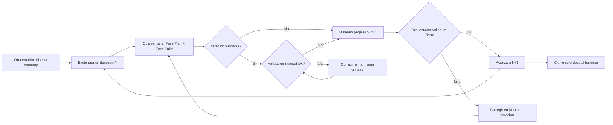

# Iteration Roadmap Playbook — Prompts Plan + Build

_Metodología reusable para partir trabajo multi-paso en iteraciones chicas, cada una ejecutada en una ventana aparte de Cursor con un prompt autocontenido (Fase Plan + Fase Build), validando el output antes de avanzar._

**Referencia:** `@.agency-os/ITERATION-ROADMAP-PLAYBOOK.md`

---

## 1. Propósito y cuándo usarlo

### Cuándo SÍ

Usá este playbook cuando el trabajo:

- Tiene **varios pasos** con dependencias entre sí (refactor habilitador → features que lo usan).
- Conviene **revisar y validar** después de cada paso (build verde, paridad de comportamiento).
- Es **acotado** a un grupo de backlog, un stage, un refactor o una feature mediana.
- Beneficia de **separar** la orquestación (diseño del roadmap, validación) de la ejecución (código en otra ventana).

### Cuándo NO

No lo uses para:

- Tareas triviales de 1–2 pasos sin dependencias.
- Cambios de una sola línea o fixes puntuales.
- Trabajo donde no hace falta validar entre pasos.

---

## 2. Roles

| Rol | Quién | Responsabilidad |
|-----|-------|-----------------|
| **Orquestador** | Chat principal (diseño del roadmap) | Diseña el roadmap de iteraciones; lee el código real antes de cada prompt; emite prompts autocontenidos; valida el output contra el «Cierre» de cada iteración; adapta el siguiente prompt a lo que realmente cambió. |
| **Ventana ejecutora** | Otra ventana de Cursor | Recibe un prompt por iteración. **Fase 1 — Plan:** plan detallado sin escribir código. **Fase 2 — Build:** implementación + `check`/`build` + actualización del doc de progreso. |
| **Humano** | Operador | Copia el prompt en la ventana ejecutora; pega el output de vuelta al Orquestador; ejecuta la validación manual en sala cuando el roadmap lo requiera. |

### Modelos recomendados (parametrizables)

| Fase | Modelo sugerido | Notas |
|------|-----------------|-------|
| Plan | Opus 4.8 (o equivalente de planificación) | Análisis, inventario de archivos, riesgos, invariantes. |
| Build | Composer 2.5 (o equivalente de construcción) | Implementación rápida siguiendo el plan. |

El Orquestador puede ajustar modelos según disponibilidad; lo importante es mantener la separación Plan / Build.

---

## 3. El loop



### Pasos en detalle

1. **Diseñar** — El Orquestador define N iteraciones con objetivo, archivos clave, criterio de «Cierre» y si la iteración es **validable** (expone un mecanismo final que el usuario ve en sala) o no.
2. **Emitir** — Se entrega al Humano **un solo prompt** para la iteración N (autocontenido).
3. **Ejecutar** — El Humano lo corre en otra ventana: Plan → Build.
4. **Validar en sala** (solo si la iteración es validable) — El Humano valida manualmente el mecanismo. Si falla, se **corrige en la misma ventana ejecutora** (no se re-emite prompt) e itera hasta que pase. Se registran los errores que aparecieron y las decisiones tomadas.
5. **Pegar** — El Humano devuelve el output (build OK, archivos, diff, Session Log) y, en iteraciones validables, el registro de errores y decisiones de la validación.
6. **Validar** — El Orquestador contrasta contra el «Cierre». Si falla, se corrige en la misma N; si pasa, se emite N+1 (adaptado al estado real del código).
7. **Cerrar** — Tras la última iteración de código y la validación manual en sala, un paso final **solo-docs** marca el stage/trabajo como completo.

---

## 4. Cómo diseñar el roadmap

### Principios

1. **Respetar los gates del repo** — En proyectos agency-os, Build exige `TECH.md` aprobado. Si el trabajo nuevo requiere ADR + stage, la **Iteración 0** suele ser **solo documentación** (TECH + PROGRESS), sin tocar `app/`.
2. **Ordenar por dependencia** — Refactors habilitadores primero; features que dependen de ellos después.
3. **Una preocupación por iteración (SRP)** — Cada iteración resuelve un ítem del checklist, no varios a la vez.
4. **Independientemente construible** — Al terminar cada iteración, `npm run check` y `npm run build` deben pasar (salvo que la iteración sea solo-docs).
5. **«Cierre» explícito** — Cada iteración declara qué debe pegar el ejecutor y qué validará el Orquestador.
6. **Paridad en refactors** — Si no cambia comportamiento product-facing, el prompt debe listar invariantes concretos.
7. **Clasificar la validación manual** — El Orquestador marca cada iteración como **validable** (el usuario ve un mecanismo final y lo valida en sala) o **no** (refactor/paso intermedio). En las validables, los errores se corrigen en la misma ventana ejecutora y solo se vuelve al Orquestador cuando la validación pasa.

### Tabla de roadmap (plantilla)

| It. | Objetivo | Archivos clave | Val. manual | Cierre |
|-----|----------|----------------|-------------|--------|
| **0** | Docs/gate (ADR + stage) | `TECH.md`, `PROGRESS.md` | — | Diffs de docs; sin código |
| **1** | … | … | Sí / — | check+build OK; … |
| **N** | … | … | Sí / — | … |

### Iteración 0 típica (gate)

Cuando el trabajo nuevo necesita stage en TECH:

- Nuevo ADR en `TECH.md` §3 (si aplica).
- Nuevo stage en `TECH.md` §5 con goal, scope, dependencies, out-of-stage, exit criteria.
- `PROGRESS.md`: header, §1 con stage `[ ]`, §2 con checklist, entrada en §3 Session Log.
- **No** modificar `SPEC.md` si el trabajo no es product-facing.

---

## 5. Plantilla de prompt (núcleo reusable)

Copiá y completá los placeholders. El prompt debe ser **100% autocontenido**: la ventana ejecutora no comparte contexto con el Orquestador.

```text
Proyecto: <PROYECTO>. FASE BUILD, <STAGE>, iteración <N> de <M>.
Interacción en <IDIOMA>. Aplicá KISS, DRY y SRP.

Leé primero:
- <ROUTER del repo, p. ej. CLAUDE.md>
- <doc de progreso: sección de checklist + última entrada de log>
- <doc técnico: stage / ADR relevante>
- <archivos de código a tocar — listar rutas concretas>

OBJETIVO
<qué resuelve esta iteración, en 1-3 frases>

CONTEXTO (opcional)
<estado actual del código relevante — el Orquestador lo redacta tras leer los archivos>

QUÉ HACER
<pasos concretos / diseño>

INVARIANTES / RESTRICCIONES (paridad)
<lo que NO debe cambiar de comportamiento; qué no tocar de otras iteraciones>

RESTRICCIONES
<gates del repo; archivos que NO tocar; límites de alcance>

FASE 1 — PLAN (no escribir código todavía)
Entregá: plan detallado (archivos a tocar, enfoque, riesgos, checklist de invariantes).
Luego seguí a Fase 2 sin esperar confirmación explícita (salvo que el prompt diga lo contrario).

FASE 2 — BUILD
Implementá el plan. Corré `npm run check` y `npm run build` (dir app/ si aplica); ambos deben
pasar sin warnings nuevos. Actualizá el doc de progreso: marcá el ítem [x] en §2 y agregá
entrada al §3 Session Log (qué cambió, archivos, next step).

VALIDACIÓN MANUAL (si la iteración es validable)
Esta iteración expone un mecanismo final que el usuario valida en sala. Tras el Build, esperá la
validación manual. Si falla, iterá y corregí en ESTA misma ventana hasta que pase (no se re-emite
prompt). Registrá los errores que aparecieron y las decisiones tomadas para resolverlos.

CIERRE (qué pegar de vuelta al Orquestador)
- Confirmación de check + build OK (y conteo de warnings).
- Lista de archivos creados/modificados.
- Diff clave (o resumen fiel si es largo).
- La entrada nueva del Session Log.
- Si la iteración es validable: errores encontrados durante la validación manual y decisiones tomadas para resolverlos.
```

### Variante: Iteración 0 (solo documentación)

```text
Proyecto: <PROYECTO>. FASE BUILD — Iteración 0 (solo documentación, sin código).

OBJETIVO
Abrir el stage en TECH + PROGRESS (gate para Build). No tocar app/.

FASE 1 — PLAN
Texto propuesto del ADR, definición del stage, lista exacta de ediciones a TECH y PROGRESS.

FASE 2 — BUILD
Aplicar el plan a TECH.md y PROGRESS.md. Agregar entrada al §3 Session Log.

CIERRE
Diffs de TECH.md y PROGRESS.md.
```

### Variante: Cierre del roadmap (solo-docs, post smoke test)

```text
Proyecto: <PROYECTO>. Cierre de <STAGE> — solo documentación.

Condición previa: el operador confirmó el smoke test en sala (listar criterios).

QUÉ HACER
Actualizar PROGRESS.md: header, §1 stage [x], §2 nota de validación, §3 entrada de cierre.
No modificar SPEC/TECH salvo que el stage lo requiera explícitamente.

CIERRE
Diff de PROGRESS.md.
```

---

## 6. Gate de validación (Orquestador)

Antes de emitir la iteración N+1, el Orquestador verifica el output de N:

| Check | Qué mirar |
|-------|-----------|
| Build | `npm run check` y `npm run build` OK; sin warnings nuevos (salvo preexistentes documentados). |
| Alcance | Solo los archivos/ítems de la iteración N; no se mezclaron otros ítems del roadmap. |
| Paridad | Invariantes listados en el prompt siguen cumplidos (comportamiento idéntico en refactors). |
| Progreso | Ítem marcado `[x]` en §2; entrada nueva en §3 con next step coherente. |
| Validación manual | Si la iteración era validable: el operador confirmó la validación en sala; revisar el registro de errores y decisiones pegado. |
| Adaptación | Si el ejecutor tomó decisiones distintas al plan, el prompt N+1 se ajusta al código real. |

Si falla: pedir corrección **en la misma iteración** (mismo número N), no avanzar.

---

## 7. Cierre del roadmap

Tras la última iteración de código:

1. El Humano ejecuta el **smoke test manual** definido en los exit criteria del stage (TECH §5).
2. Si pasa, se corre la **variante de cierre solo-docs** (marcar stage `[x]` en §1, actualizar header).
3. El Orquestador registra pendientes menores no bloqueantes en el Session Log o backlog §4.

**No** marcar un stage `[x]` en §1 sin validación manual confirmada por el operador.

> La validación manual **por iteración** (paso 4 del loop) es distinta del smoke test final: la primera valida mecanismos intermedios a medida que aparecen; el smoke test final cierra el stage contra los exit criteria de TECH §5.

---

## 8. Guardrails

- **Prompts autocontenidos** — La ventana ejecutora no tiene el historial del Orquestador. Incluir rutas de archivos, contexto de código y restricciones en cada prompt.
- **Leer antes de redactar** — El Orquestador debe leer el código real antes de cada prompt (no confiar solo en memoria de sesiones anteriores).
- **KISS, DRY, SRP** — Una iteración, una preocupación; no inflar iteraciones con trabajo opcional.
- **Idioma** — Definir en el prompt (p. ej. español para interacción y commits de progreso).
- **No ensuciar SPEC/TECH** — Trabajo no product-facing vive en PROGRESS/backlog hasta que se priorice con enmienda explícita.
- **Loop de validación en la misma ventana** — En iteraciones validables, los errores de la validación manual NO se re-emiten como prompt nuevo: se corrigen en la ventana ejecutora y solo se vuelve al Orquestador cuando la validación pasa, reportando errores y decisiones tomadas.
- **Session Log** — Cada Build actualiza el doc de progreso al final de la sesión.
- **No editar el plan adjunto** — Si usás un plan de Cursor aparte, el playbook es la fuente de verdad del proceso; el plan es input puntual, no se versiona como metodología.

---

## 9. Referencia rápida

| Concepto | Dónde vive en agency-os |
|----------|-------------------------|
| Router del monorepo | `CLAUDE.md` |
| Guía por fase | `.agency-os/CONTEXT.md` |
| Progreso del build | `/<proyecto>/PROGRESS.md` |
| Roadmap y ADRs | `/<proyecto>/TECH.md` |
| Este playbook | `.agency-os/ITERATION-ROADMAP-PLAYBOOK.md` |

**Uso típico en un chat nuevo:**

> Seguí el proceso de `@.agency-os/ITERATION-ROADMAP-PLAYBOOK.md`. Quiero un roadmap con iteraciones para \<descripción del trabajo\> en \<proyecto\>. Dame el prompt de la Iteración 0.

---

_Maintained as agency-os methodology. Replicable en cualquier proyecto del monorepo._
