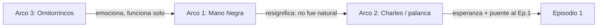

# Estrategia de contenido para redes

> Qué contamos y en qué formato. El "cómo producirlo" vive en [pipeline.md](../../../metodo/pipeline.md). El canon está en [biblia-serie.md](../biblia-serie.md).

---

## 1. Marco narrativo: "Los cuadernos reconstruidos de Charles Jones"

Todo el contenido generado con IA se presenta como **reconstrucciones de los diarios de CFJ**: material "recuperado" e ilustrado/animado a partir de sus cuadernos caóticos.

Por qué este marco resuelve todo:

- **Coherencia con el canon**: los diarios de CFJ son "caóticos e imposibles de verificar" → cualquier inconsistencia visual de la IA queda justificada dentro de la ficción.
- **Permite a Charles estar en Pangea** sin explicación literal: es el disparate solemne del personaje. "¿Cómo llegó ahí? Eso no es lo importante."
- **Habilita la voz en off documental** (registro Attenborough) sobre imágenes prehistóricas: es literalmente el formato del proyecto.

Cada pieza puede abrir con un recurso de "página de cuaderno" (papel, anotaciones manuscritas, tachones) antes de entrar a la animación.

---

## 2. El hallazgo que ancla todo

El arco de Pangea **ya está plantado en el guion del episodio 1**: el fósil de ornitorrinco de Rocas Coloradas, datado en ~62M años, que "demuestra la antigua conexión entre dos continentes: extinguiéndose en Patagonia pero sobreviviendo en Australia".

Consecuencia: **la familia de ornitorrincos de las historias de redes ES el fósil del episodio 1.** El contenido de redes no es material suelto: es **precuela canónica** del episodio. Quien vea las redes y luego el episodio (o viceversa) recibe una recompensa narrativa.

---

## 3. Los tres arcos

Resumen; el detalle está en cada archivo.

1. **La Mano Negra** — La Fundación es eterna y planifica las extinciones a escala geológica. [arco-1-mano-negra.md](arco-1-mano-negra.md)
2. **Charles y la palanca** — CFJ interviene en puntos mínimos de apalancamiento con consecuencias enormes. [arco-2-charles-palanca.md](arco-2-charles-palanca.md)
3. **La familia de ornitorrincos** — El drama emocional; los divididos por la grieta y el final en fosilización. [arco-3-ornitorrincos.md](arco-3-ornitorrincos.md)

---

## 4. Fuente por hilo y orden de producción

Los tres arcos son la **fuente** (hilo narrativo + clips generados), no entregables. El orden **Arco 3 → Arco 1 → Arco 2** es el orden en que se bajan a fichas y se producen, porque cada hilo resignifica al anterior (regla de 3 estructural del proyecto):

- **Arco 3 primero**: es autoconclusivo y golpea emocionalmente. Instala a los ornitorrincos y el yacimiento.
- **Arco 1 después**: revela que la separación no fue natural → resignifica la muerte del Arco 3 como un crimen.
- **Arco 2 al final**: introduce a Charles interviniendo → esperanza, y conecta directamente con el sueño del episodio 1.

De esa fuente salen las piezas publicables (§5): un mismo clip de un hilo puede alimentar tanto un reel transversal como una destacada de su arco.

---

## 5. Salidas y formatos

Dos familias de **salida** se montan a partir de la fuente por hilo, más el feed de lore:

| Familia | Alcance | Duración | Qué es | Dónde vive |
|---|---|---|---|---|
| **Reel transversal** | cruza los 3 hilos | 30–45s | Intercala clips de varios arcos para contar las tres historias en una pieza | `reels/<slug>/` (hoy [reels/la-grieta/](reels/la-grieta/)) |
| **Destacadas** | un solo hilo | 15s c/u, series de 3–5 | Mini-historias de un arco → historias destacadas de IG (goteo, encuestas, "página del cuaderno") | `destacadas/arco-N/` (diferido; ver abajo) |
| **Feed (carrusel)** | transversal | estático | "Páginas del cuaderno de Charles" (imágenes madre + anotaciones) | lore, costo casi nulo, fija identidad visual |

Las **destacadas por arco** se documentan pero **no se crean como carpetas vacías**: `redes/destacadas/arco-N/` se materializa recién cuando se monta la primera pieza de ese hilo. Las del Arco 3 coinciden con las Stories S1–S5 ya catalogadas en [SPEC.md](SPEC.md)/[PROGRESS.md](PROGRESS.md).

Pieza estrella dentro del reel transversal: el final del hilo del Arco 3 (fosilización → corte al plano real del fósil del episodio 1).

---

## 6. Conexiones explícitas con el episodio 1

Puntos de contacto que premian al espectador atento:

- **El fósil**: el ornitorrinco del Arco 3 termina siendo el fósil que Jorgito manosea en Rocas Coloradas.
- **El sueño del lugar blanco**: en el Arco 2, Charles medita en Pangea y el plano se funde al banquito blanco del episodio 1, donde le dice a Jorgito "es en Rocas Coloradas". Reinterpreta el sueño: no fue un sueño de Jorgito, fue Charles transmitiendo desde otra era.
- **La Fundación**: cierre del Arco 1 con la frase textual de Fran sobre "los animales que tenemos planeado extinguir".
- **La cadenita de oro**: firma de la Mano Negra = el detalle de vestuario de Fran.
